# Policy Distillation Report

Date: March 13, 2026

## Scope

This update completes the SHAP-informed distillation pass using the policy's exact raw goal features `goal_dx` and `goal_dy`, adds explicit velocity damping terms `vx` and `vy`, plugs the resulting equation into the trajectory simulator, and records the new comparison artifacts under `policy_analysis/`.

## SHAP-Informed Raw-Feature Equation

The updated optimizer searched repulsion geometries while keeping the SHAP-driven feature set fixed:

- Goal attraction terms: `goal_dx`, `goal_dy`
- Velocity damping terms: `vx`, `vy`
- Obstacle term: nearest-obstacle repulsion projected onto x/y

Best formulation selected by the optimizer:

- Repulsion family: `exp_decay_0.5_thr4.0`
- Repulsion definition:
  `repulsion = away_vec * exp(-0.5 * clearance)` when `clearance < 4.0`, otherwise `0`
- Samples used: `30000`
- Random seed: `7`
- Overall fit: `R^2 = 0.6224`
- Per-axis fit: `R^2_x = 0.7027`, `R^2_y = 0.5422`
- Mean absolute action error: `0.3873`

Final equation:

```text
Action X = 0.0429 + 0.1437 * goal_dx - 0.0119 * vx + 0.4630 * repulsion_x
Action Y = -0.0620 + 0.1134 * goal_dy - 0.0071 * vy + 0.6509 * repulsion_y
```

Saved artifacts:

- Equation JSON: `policy_analysis/shap_distillation_equation.json`
- Equation markdown summary: `policy_analysis/shap_distillation_equation.md`
- Existing SHAP plots: `policy_analysis/explain/shap_summary_vx.png`, `policy_analysis/explain/shap_summary_vy.png`

## Trajectory Comparison

The distilled SHAP controller was integrated into the simulator and compared directly against the SAC neural network in curriculum stage 1 using seeds `42, 43, 44, 45`.

Comparison summary:

| Controller | Success | Collision | Timeout | Mean path length | Mean reward |
| --- | --- | --- | --- | --- | --- |
| Original Neural Network | 4/4 | 0/4 | 0/4 | 14.6913 | 516.3628 |
| SHAP Distilled Equation | 4/4 | 0/4 | 0/4 | 15.3331 | 402.5409 |

Interpretation:

- The SHAP equation preserved success on all four comparison seeds.
- The distilled controller is still less efficient than the neural network: it takes more steps and earns lower reward on average.
- The added damping terms stabilize the controller, but the linear raw-feature fit remains an approximation of the full policy.

Saved comparison artifacts:

- Plot: `policy_analysis/6_shap_vs_nn_trajectories.png`
- Metrics: `policy_analysis/6_shap_vs_nn_trajectories.json`

## Files Updated

- `optimize_shap_equation.py`
- `extract_shap_equation.py`
- `compare_trajectories.py`
- `shap_distillation.py`
- `policy_analysis/Policy_Distillation_Report.md`

## Existing Policy Analysis Figures

The following earlier analysis figures are retained and referenced here so the report keeps the older policy-analysis context alongside the new SHAP update.

### Baseline analysis plots

- `policy_analysis/1_action_vector_field.png`
- `policy_analysis/2_q_value_landscape.png`
- `policy_analysis/3_policy_vs_potential_field.png`
- `policy_analysis/4_sensitivity_analysis.png`
- `policy_analysis/5_trajectory_traces.png`

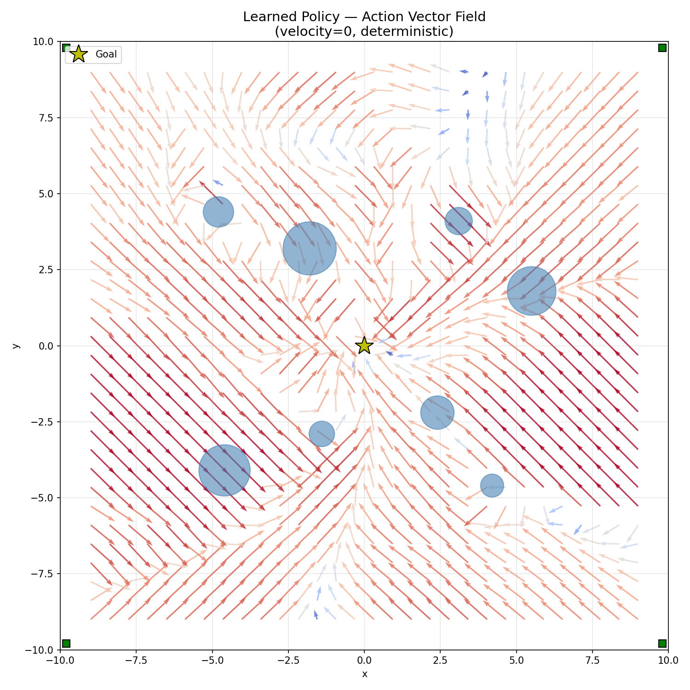

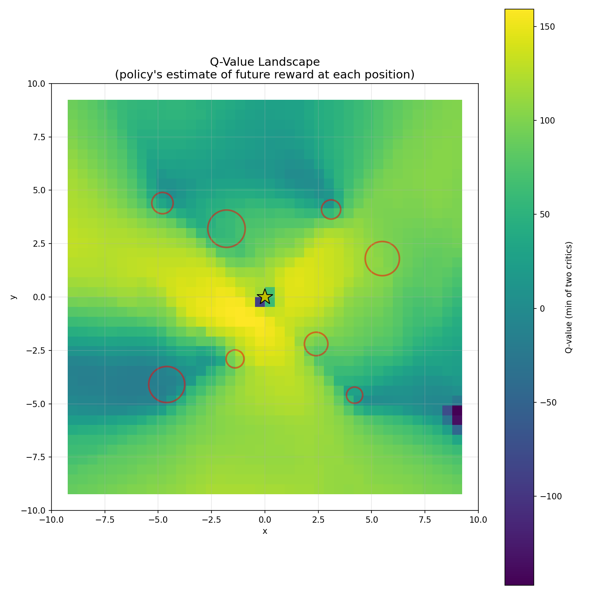

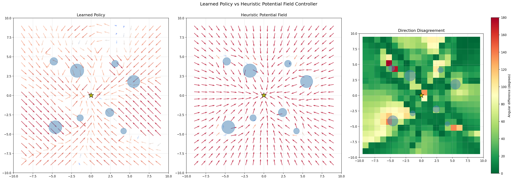

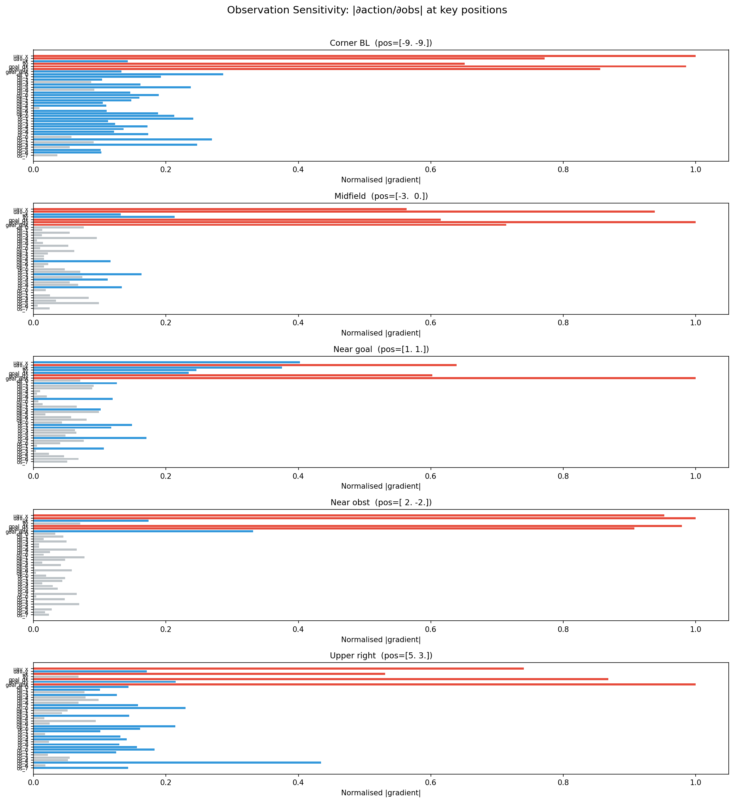

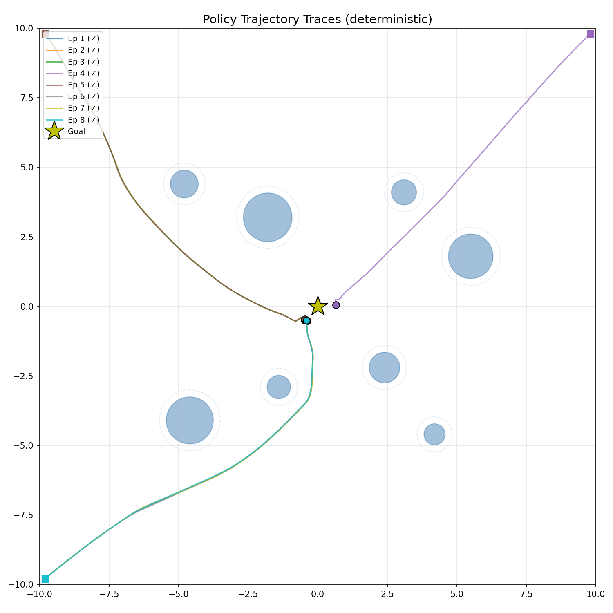

### Existing SHAP explanation plots

- `policy_analysis/explain/shap_summary_vx.png`
- `policy_analysis/explain/shap_summary_vy.png`
- `policy_analysis/explain/lime_explain_vx.png`
- `policy_analysis/explain/lime_explain_vy.png`

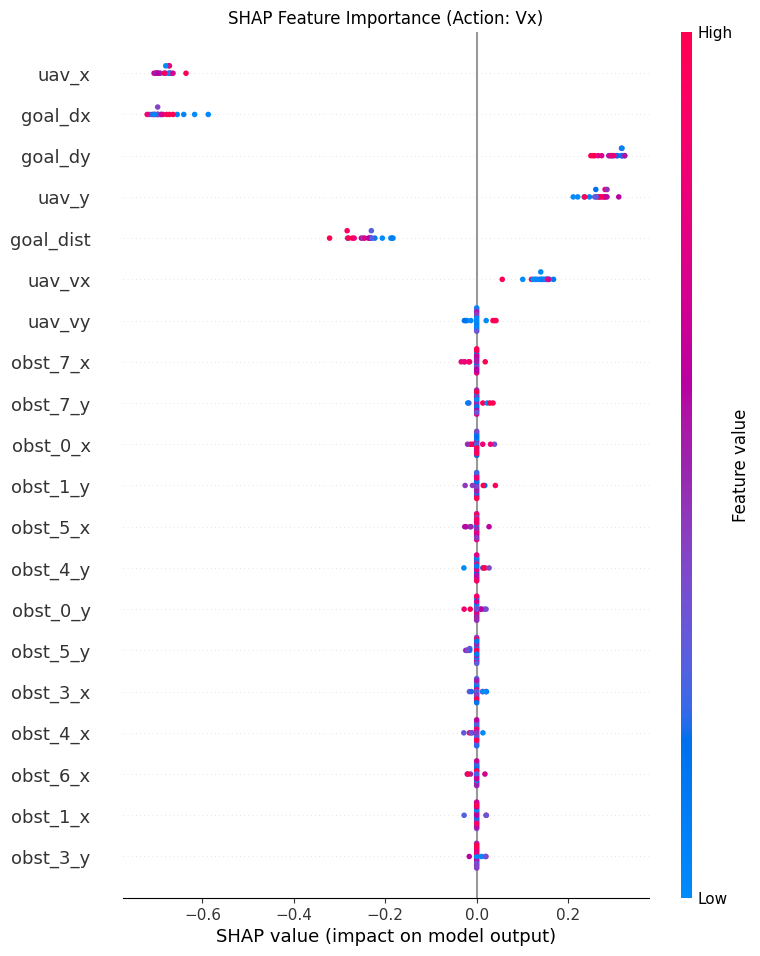

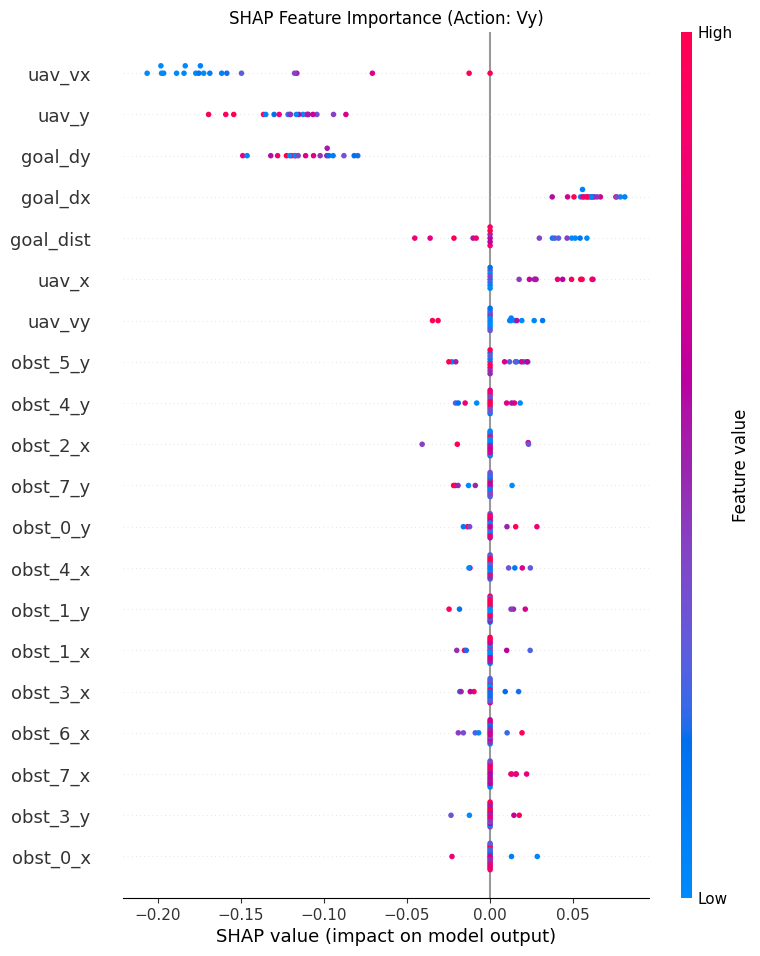

## Equation Archive

This section keeps the earlier distilled equations in the same report and adds the new SHAP-informed raw-feature equation without removing prior controller formulas.

### Earlier physical APF-style controller

From the existing distilled controller implementation:

```text
Action = 0.894 * (goal_vec / ||goal_vec||)
       - 0.014 * velocity
       + 0.010 * (away_vec / clearance^2), when clearance < 3.0
```

Implementation source: `eval_distilled_controller.py`

### Earlier unified physics extraction template

From the unsquared physical regression script:

```text
A_vector = K_goal * (G_vec / ||G_vec||) - K_damp * V_vec + K_rep * (Away_vec / Clearance^2)
```

Implementation source: `extract_physics_equation.py`

### New SHAP-informed raw-feature controller

```text
Action X = 0.0429 + 0.1437 * goal_dx - 0.0119 * vx + 0.4630 * repulsion_x
Action Y = -0.0620 + 0.1134 * goal_dy - 0.0071 * vy + 0.6509 * repulsion_y
```

Repulsion model:

```text
repulsion = away_vec * exp(-0.5 * clearance), when clearance < 4.0
repulsion = 0, otherwise
```

## New Plot Added To This Report

The new controller trajectory comparison is retained with the older plots instead of replacing them.

- `policy_analysis/6_shap_vs_nn_trajectories.png`
- `policy_analysis/6_shap_vs_nn_trajectories.json`

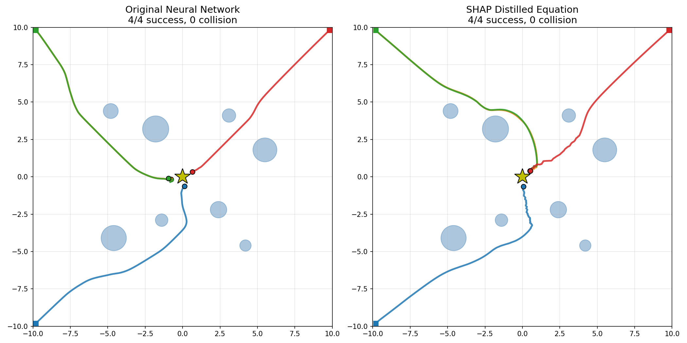

## TD3 And DDPG Distilled Equations

The TD3 and DDPG baselines already had SHAP/LIME explanation outputs from the policy-analysis suite. I additionally corrected the sparse linear equation export so the reported coefficients are now in the original raw feature space instead of the standardized feature space used during fitting.

These are therefore usable raw-feature distilled equations, derived from the same explainability suite that produced the SHAP and LIME outputs, but they are not yet the separate SHAP-optimizer-style raw-feature extraction used earlier for the SAC controller.

### TD3 distilled raw-feature equations

- `R^2_x = 0.6974`
- `R^2_y = 0.7334`

```text
action_x = 0.0482 + 0.1120 * goal_dx + 0.0828 * goal_dy
action_y = 0.1099 + 0.1500 * goal_dy
```

Source artifact:

- `gym_pybullet_drones/examples/runs/kf_nav_suite/kf_baselines_20260314-164705/runs/td3_modified_static_nav_kf_baselines_20260314-173657/policy_analysis/distill/distillation_summary.json`

### DDPG distilled raw-feature equations

- `R^2_x = 0.5538`
- `R^2_y = 0.6267`

```text
action_x = 0.3151 + 0.0992 * goal_dx - 0.0552 * goal_dy - 0.0510 * vx + 0.0293 * vy
action_y = -0.1786 + 0.1332 * goal_dy + 0.0194 * vx
```

Source artifact:

- `gym_pybullet_drones/examples/runs/kf_nav_suite/kf_baselines_20260314-164705/runs/ddpg_modified_static_nav_kf_stage4_optuna_20260314-204207/policy_analysis/distill/distillation_summary.json`

## TD3 And DDPG Trajectory Overlays

I compared each distilled equation directly against its own original policy in curriculum stage 4 on seeds `42, 43, 44, 45`. The target here is not just success, but closeness of the distilled trace to the original policy trace.

Comparison summary:

| Algorithm | Original policy success | Distilled equation success | Mean trace deviation (m) | Mean endpoint distance (m) |
| --- | --- | --- | --- | --- |
| TD3 | 4/4 | 2/4 | 4.805 | 3.392 |
| DDPG | 4/4 | 0/4 | 5.858 | 6.659 |

Interpretation:

- Correcting the coefficient scaling bug materially improved the TD3 distilled controller compared with the earlier invalid raw equation.
- TD3 still only partially tracks the original policy: two seeds succeed, but the traces remain visibly different.
- DDPG is much harder to distill with the current sparse linear form; its equation still diverges substantially from the original policy traces.
- So, at the moment, TD3 is the better candidate for a closer equation-based surrogate, while DDPG likely needs a richer equation class or a dedicated SHAP-style optimizer pass.

Saved comparison artifacts:

- Plot: `policy_analysis/7_td3_ddpg_distilled_vs_policy_trajectories.png`
- Metrics: `policy_analysis/7_td3_ddpg_distilled_vs_policy_trajectories.json`

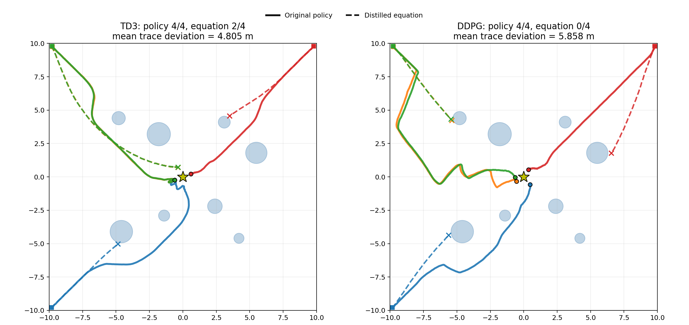

## Earliest Saved Perfect-Success Checkpoint Comparison

To check whether the poor distilled rollouts were caused by the reward tie-break among many `100%`-success checkpoints, I reran the trajectory comparison using earlier saved checkpoints that already sat inside the `100%` paper-eval regime.

Chosen checkpoints:

- TD3: `td3_static_nav_250000_steps.zip`
- DDPG: `ddpg_static_nav_750000_steps.zip`

### TD3 earliest-perfect saved checkpoint equations

- `R^2_x = 0.7649`
- `R^2_y = 0.6433`

```text
action_x = -0.1436 + 0.1516 * goal_dx + 0.0373 * goal_dy
action_y = -0.2777 - 0.0416 * goal_dx + 0.1336 * goal_dy - 0.0205 * vx
```

### DDPG earliest-perfect saved checkpoint equations

- `R^2_x = 0.5400`
- `R^2_y = 0.7041`

```text
action_x = 0.0241 + 0.1204 * goal_dx - 0.0476 * vx + 0.0307 * vy
action_y = -0.2706 + 0.1340 * goal_dy
```

### Trajectory comparison summary

I again compared the original policies against their distilled equations on stage 4 with seeds `42, 43, 44, 45`.

| Algorithm | Original policy success | Distilled equation success | Mean trace deviation (m) | Mean endpoint distance (m) |
| --- | --- | --- | --- | --- |
| TD3 | 4/4 | 0/4 | 4.915 | 2.112 |
| DDPG | 4/4 | 0/4 | 5.244 | 3.357 |

Interpretation:

- Switching to earlier perfect-success checkpoints did not solve the rollout-fidelity problem.
- TD3 became slightly worse in closed-loop success than the later tie-broken checkpoint, even though its one-step `R^2_x` improved.
- DDPG remained poor, which indicates the main failure is the linear surrogate itself, not just checkpoint selection.
- The target is still to match the original policy traces more closely; these results show that sparse linear equations are not yet faithful enough for stage-4 closed-loop control.

Saved comparison artifacts:

- Plot: `policy_analysis/8_td3_ddpg_earliest_perfect_checkpoint_distilled_vs_policy_trajectories.png`
- Metrics: `policy_analysis/8_td3_ddpg_earliest_perfect_checkpoint_distilled_vs_policy_trajectories.json`

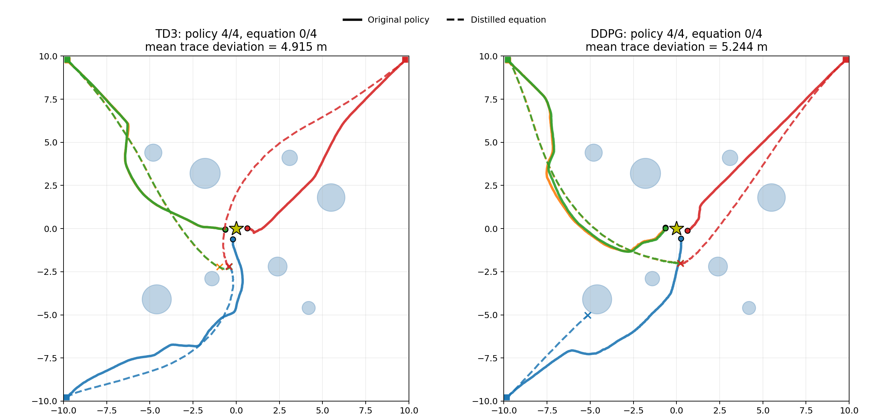

## TD3 And DDPG SHAP-Informed Raw-Feature Equations

I generalized the SAC-style SHAP-equation path so it now works for any SB3 policy, and reran the full analysis suite for the TD3 and DDPG best checkpoints. That regenerated:

- SHAP and LIME outputs under each run's `policy_analysis/explain/`
- the existing sparse linear and decision-tree distillation under `policy_analysis/distill/`
- a new SHAP-informed raw-feature equation under `policy_analysis/shap_equation/`

These equations are the direct TD3/DDPG analogue of the earlier SAC SHAP controller, using raw `goal_dx`, `goal_dy`, damping, and a fitted nearest-obstacle repulsion term family.

### TD3 SHAP-informed equation

- Best repulsion family: `linear_spring_thr4.0`
- `R^2_full = 0.5917`
- `R^2_x = 0.4508`
- `R^2_y = 0.7326`
- `MAE = 0.4399`

```text
Action X = 0.0463 + 0.1098 * goal_dx + 0.0077 * vx - 0.0193 * repulsion_x
Action Y = 0.1088 + 0.1509 * goal_dy - 0.0023 * vy + 0.0033 * repulsion_y
```

SHAP/LIME signal:

- TD3 action X is dominated by `uav_x`, `goal_dx`, and `goal_dist`.
- TD3 action Y is dominated by `uav_y`, `goal_dy`, `uav_x`, and `goal_dx`.
- Obstacle features are weak in both SHAP and LIME, which matches the tiny fitted repulsion coefficients in the equation.

### DDPG SHAP-informed equation

- Best repulsion family: `linear_spring_thr4.0`
- `R^2_full = 0.5488`
- `R^2_x = 0.4189`
- `R^2_y = 0.6788`
- `MAE = 0.4409`

```text
Action X = 0.3158 + 0.1000 * goal_dx - 0.0580 * vx + 0.0049 * repulsion_x
Action Y = -0.1774 + 0.1469 * goal_dy - 0.0131 * vy + 0.1303 * repulsion_y
```

SHAP/LIME signal:

- DDPG action X is dominated by `goal_dx`, `goal_dist`, `uav_x`, and `uav_y`.
- DDPG action Y is mostly shaped by `goal_dx`, `uav_x`, `uav_y`, and then `goal_dy`.
- Compared with TD3, DDPG retains a more meaningful `repulsion_y` term in the fitted equation.

## TD3 And DDPG SHAP Trajectory Overlays

I compared the original policies against these new SHAP-informed equations on stage 4 with seeds `42, 43, 44, 45`.

| Algorithm | Original policy success | SHAP equation success | Mean trace deviation (m) | Mean endpoint distance (m) |
| --- | --- | --- | --- | --- |
| TD3 | 4/4 | 1/4 | 7.103 | 5.236 |
| DDPG | 4/4 | 2/4 | 3.553 | 3.453 |

Interpretation:

- The SHAP raw-feature equation is a genuine improvement path for DDPG: it reaches `2/4` success and tracks two seeds quite closely.
- TD3 does not benefit from this equation family yet; its fitted repulsion term is too weak, and the closed-loop traces diverge early into collisions on three seeds.
- So, at the moment, DDPG is the better candidate for SHAP-style raw-feature distillation, while TD3 likely needs a richer repulsion geometry or on-policy trajectory-conditioned fitting.

Saved comparison artifacts:

- Plot: `policy_analysis/9_td3_ddpg_shap_distilled_vs_policy_trajectories.png`
- Metrics: `policy_analysis/9_td3_ddpg_shap_distilled_vs_policy_trajectories.json`

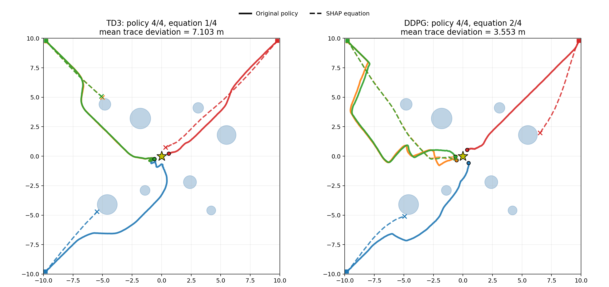

## SAC SHAP Equation Under Stage 4

I reran the SAC SHAP-equation comparison on `curriculum_stage = 4`, which means the evaluation now includes the Kalman-filter stage together with the stage-4 drag and wind dynamics.

This is important because the earlier SAC figure in this report used the default trajectory-comparison setting and was saved at stage 1. The stage-4 rerun checks whether the same SHAP equation still holds up in the harder environment.

### SAC stage-4 SHAP equation

- Best repulsion family: `exp_decay_0.5_thr4.0`
- `R^2_full = 0.6224`
- `R^2_x = 0.7027`
- `R^2_y = 0.5422`
- `MAE = 0.3873`

```text
Action X = 0.0429 + 0.1437 * goal_dx - 0.0119 * vx + 0.4630 * repulsion_x
Action Y = -0.0620 + 0.1134 * goal_dy - 0.0071 * vy + 0.6509 * repulsion_y
```

### SAC stage-4 trajectory summary

| Algorithm | Original policy success | SHAP equation success | Mean trace deviation (m) | Mean endpoint distance (m) |
| --- | --- | --- | --- | --- |
| SAC | 4/4 | 4/4 | 2.149 | 0.797 |

Interpretation:

- The SAC equation remains strong even under the Kalman-filter stage-4 setup.
- So the earlier SAC result was not only a stage-1 artifact; SAC is genuinely easier to capture with this SHAP raw-feature controller family.
- The main differences versus TD3/DDPG are still visible in the fitted equation itself: SAC keeps strong repulsion coefficients and lower action-level error.

## Stage-4 SHAP Comparison Across SAC, TD3, And DDPG

I then compared all three SHAP-informed equations on the same stage-4 setup and the same seeds `42, 43, 44, 45`.

| Algorithm | Original policy success | SHAP equation success | Mean trace deviation (m) | Mean endpoint distance (m) |
| --- | --- | --- | --- | --- |
| SAC | 4/4 | 4/4 | 2.149 | 0.797 |
| TD3 | 4/4 | 1/4 | 7.103 | 5.236 |
| DDPG | 4/4 | 2/4 | 3.553 | 3.453 |

Interpretation:

- SAC still distills the best by a clear margin even after forcing the comparison onto the Kalman-filter stage-4 environment.
- DDPG is the second-best candidate for SHAP-style raw-feature distillation.
- TD3 remains the weakest of the three under the current equation family because its fitted obstacle response is too weak in closed loop.

Saved comparison artifacts:

- Plot: `policy_analysis/10_sac_td3_ddpg_stage4_shap_distilled_vs_policy_trajectories.png`
- Metrics: `policy_analysis/10_sac_td3_ddpg_stage4_shap_distilled_vs_policy_trajectories.json`

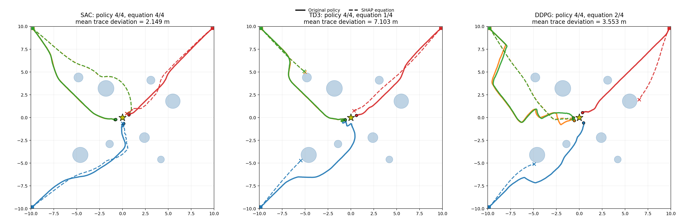

## Final Rollout-Selected SHAP Equations

I extended the SHAP equation pipeline in three ways:

- on-policy stage-4 rollout sampling
- a richer contextual feature basis guided by SHAP/LIME
- rollout-aware selection between three equation families:
  - legacy nominal compact
  - on-policy compact
  - on-policy contextual

The selection rule is no longer "highest one-step `R^2` only". Instead, the final equation for each algorithm is chosen by held-out stage-4 rollout success first, then trace deviation, then `R^2`.

This matters because the richer contextual fit improved one-step regression a lot for TD3/DDPG, but not every high-`R^2` equation behaved well in closed loop.

### Final selected SAC equation

- Selected family: `legacy_nominal_compact`
- Best repulsion candidate: `exp_decay_0.5_thr4.5`
- `R^2_full = 0.6237`
- Held-out rollout validation: `4/4` success

```text
Action X = 0.0427 + 0.1442 * goal_dx - 0.0120 * vx + 0.4725 * repulsion_x
Action Y = -0.0624 + 0.1144 * goal_dy + 0.6592 * repulsion_y
```

### Final selected TD3 equation

- Selected family: `contextual`
- Best repulsion candidate: `exp_decay_2.0_thr4.5`
- `R^2_full = 0.8326`
- Held-out rollout validation: `0/4` success

```text
Action X = -0.0649 + 0.4012 * goal_dx + 0.0549 * vx - 0.8803 * repulsion_x + 1.1576 * repulsion_x_gate + 0.3748 * uav_x - 0.0089 * uav_y + 0.0732 * danger_gate
Action Y = -0.0145 + 0.1173 * goal_dy + 0.0613 * vy + 1.2705 * repulsion_y - 2.0142 * repulsion_y_gate + 0.0961 * uav_y + 0.2688 * goal_dx + 0.2576 * uav_x
```

Interpretation:

- TD3 really did need the richer basis to keep obstacle and position terms.
- Even after that, the distilled controller still fails in closed loop, so the issue is not only missing terms; the learned TD3 policy is simply not well captured by this interpretable family.

### Final selected DDPG equation

- Selected family: `legacy_nominal_compact`
- Best repulsion candidate: `linear_spring_thr4.5`
- `R^2_full = 0.5518`
- Held-out rollout validation: `2/4` success

```text
Action X = 0.3158 + 0.1002 * goal_dx - 0.0580 * vx
Action Y = -0.1778 + 0.1502 * goal_dy - 0.0130 * vy + 0.1175 * repulsion_y
```

Interpretation:

- DDPG did benefit from trying the richer contextual basis, but the held-out rollout selector still preferred the simpler legacy compact equation.
- So for DDPG, the more complicated contextual fit improved regression scores but did not beat the simpler surrogate consistently enough in closed loop.

## Final Stage-4 SHAP Comparison

I then reran the trajectory comparison using the final rollout-selected equation for each algorithm on stage 4 with seeds `42, 43, 44, 45`.

| Algorithm | Original policy success | Final SHAP equation success | Mean trace deviation (m) | Mean endpoint distance (m) |
| --- | --- | --- | --- | --- |
| SAC | 4/4 | 4/4 | 2.154 | 0.795 |
| TD3 | 4/4 | 0/4 | 7.075 | 5.012 |
| DDPG | 4/4 | 2/4 | 3.557 | 3.460 |

Final interpretation:

- SAC remains the strongest case: the simple SHAP compact equation is still a very good surrogate under the Kalman-filter stage-4 environment.
- DDPG is partially distillable, but not yet close enough on all seeds.
- TD3 remains the weakest case even after adding contextual terms and rollout-aware selection.
- So the final best trajectory-matching order is: `SAC > DDPG > TD3`.

Saved final selected comparison artifacts:

- Plot: `policy_analysis/16_sac_td3_ddpg_final_selected_stage4_shap_distilled_vs_policy_trajectories.png`
- Metrics: `policy_analysis/16_sac_td3_ddpg_final_selected_stage4_shap_distilled_vs_policy_trajectories.json`
- TD3/DDPG-only plot: `policy_analysis/15_td3_ddpg_final_selected_shap_distilled_vs_policy_trajectories.png`
- TD3/DDPG-only metrics: `policy_analysis/15_td3_ddpg_final_selected_shap_distilled_vs_policy_trajectories.json`

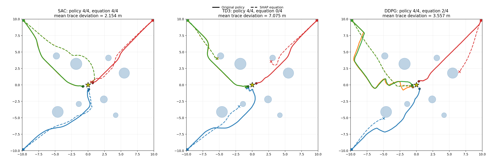
